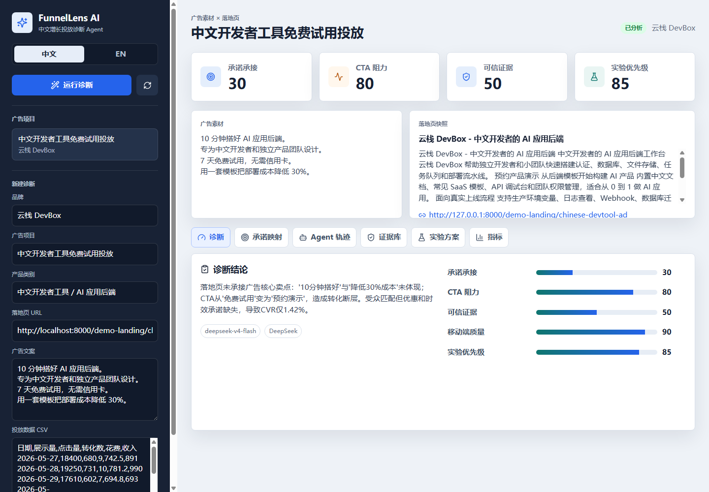

# FunnelLens AI 转化镜

面向中文开发者工具增长团队的**广告转化诊断 Agent**。

FunnelLens AI 会分析广告文案、落地页和投放数据，自动找出“广告承诺”和“落地页承接”之间的断点，并生成带证据链的 A/B 实验方案。



## 面试展示入口

- 线上 Demo：部署后填写 Vercel 前端链接
- 后端健康检查：部署后填写 Vercel 后端 `/health` 链接
- 演示视频：部署后填写 B 站 / 飞书 / 腾讯文档 / 附件链接

## 为什么做这个

很多中文开发者工具、AI SaaS 和独立产品团队在投广告时，会遇到一个典型问题：广告点击不少，但注册转化低。

常见原因不是“广告写得不够花”，而是：

- 广告说“7 天免费试用”，落地页却让用户“预约演示”
- 广告说“10 分钟搭好后端”，落地页首屏没有承接
- 广告说“成本降低 30%”，页面没有证据
- 投放团队知道 CVR 低，但不知道优先改素材还是落地页

FunnelLens AI 的核心就是自动诊断这些断点。

## 核心功能

- **广告承诺抽取**：把广告文案拆成 claim，例如免费试用、时效承诺、成本承诺、目标人群。
- **落地页抓取**：抓取落地页标题、首屏、CTA、正文和证据片段。
- **承诺映射**：判断每个广告承诺在落地页里是已承接、弱承接、缺失还是冲突。
- **Agent 轨迹**：展示任务规划、落地页抓取、指标分析、DeepSeek 推理、证据记录、实验生成。
- **证据库**：每个 AI 判断都绑定落地页证据或缺失证据。
- **实验方案**：生成 A/B 测试 brief，包括假设、改动建议、成功指标、优先级和实现成本。

## 技术栈

- 前端：React + Vite + Recharts + lucide-react
- 后端：FastAPI + SQLAlchemy
- 数据库：本地 SQLite，线上 Supabase Free Postgres
- AI：DeepSeek OpenAI-compatible API，默认模型 `deepseek-v4-flash`
- 部署：Vercel 前端 + Vercel FastAPI 后端 + Supabase Free

## 本地启动

### 后端

```powershell
cd backend
python -m venv .venv
.venv\Scripts\Activate.ps1
pip install -r requirements.txt
copy .env.example .env
python -m uvicorn app.main:app --reload --port 8000
```

后端默认使用本地 SQLite。如果没有配置 DeepSeek key，系统会使用本地 fallback 规则生成中文演示结果。

### 前端

```powershell
cd frontend
npm install
copy .env.example .env
npm run dev
```

本地访问：`http://localhost:5173`

## 线上部署

完整部署步骤见 [DEPLOYMENT.md](DEPLOYMENT.md)。

关键配置：

- 前端 Vercel 环境变量：`VITE_API_BASE=https://<your-backend>.vercel.app`
- 后端 Vercel 环境变量：`DEEPSEEK_API_KEY`、`DATABASE_URL`、`FRONTEND_ORIGIN`
- 数据库使用 Supabase **Transaction Pooler**，端口 `6543`

线上 `/health` 应显示：

```json
{
  "status": "ok",
  "database": "postgres",
  "deepseek_configured": true
}
```

## 面试讲法

一句话：

> 我做的是一个面向中文开发者工具增长团队的广告转化诊断 Agent。它不是帮你生成广告，而是检查广告承诺和落地页承接是否一致，并把诊断结果变成可验证的 A/B 实验方案。

2 分钟演示脚本见 [VIDEO_SCRIPT.md](VIDEO_SCRIPT.md)。

发布前安全检查见 [SECURITY_CHECKLIST.md](SECURITY_CHECKLIST.md)。

